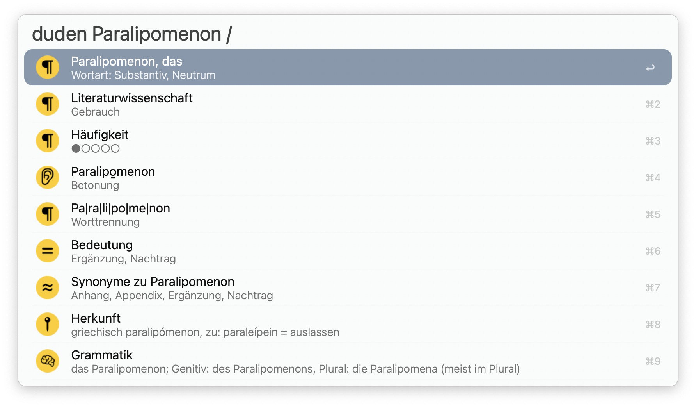
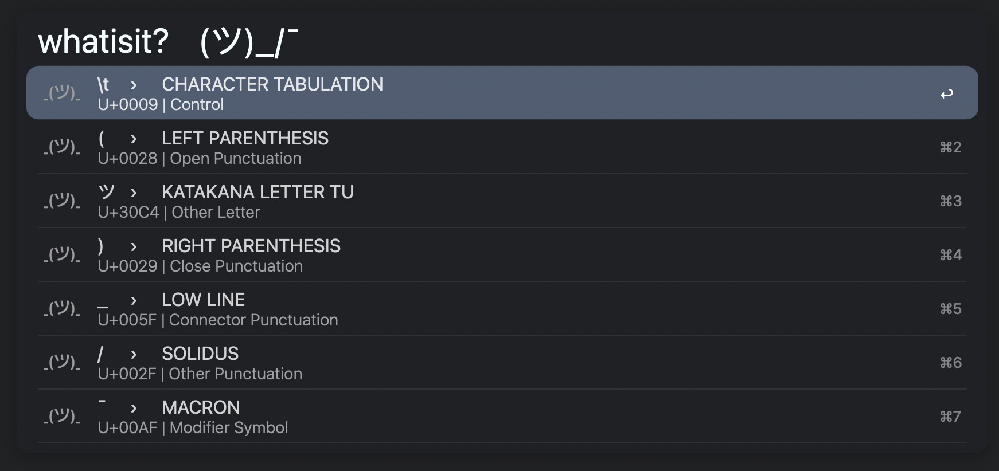
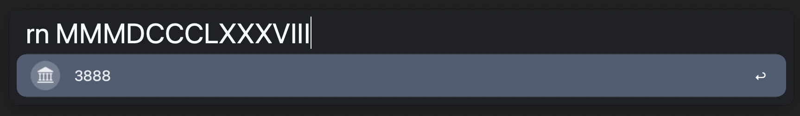

# Collected Workflows &amp; Proofs of Concept <!-- omit from toc -->

This is a collection of smaller workflows, experiments, and demonstrations of interesting concepts for writing automations with the [Alfred App](https://www.alfredapp.com/workflows/). Some Script Filter workflows live in their own repository:

- [Alfred Calendar++](https://github.com/zeitlings/alfred-calendar)
- [Set Default Browser]()

If you find my workflows useful, perhaps consider reciprocating with a token of appreciation 🤗   

  

---

Table of Contents

- [1. Workflows](#1-workflows)
  - [1.1. Duden Workflow](#11-duden-workflow)
  - [1.2. What Unicode Character is this? (ツ)\_/¯](#12-what-unicode-character-is-this-ツ_)
  - [1.3. Roman Numeral Converter](#13-roman-numeral-converter)
  - [1.4. DEVONthink `↔` PDF Expert](#14-devonthink--pdf-expert)
- [2. Proof of Concept \& Demos](#2-proof-of-concept--demos)
  - [2.1. Extended Hotkeys](#21-extended-hotkeys)
  - [2.2. Permission Handler](#22-permission-handler)

# 1. Workflows

## 1.1. Duden Workflow

<table> 
    <tr>
        <td>
             
        </td>
        <td>
           Search, navigate and view information from duden.de German spelling dictionary. 
        </td>
    </tr>
</table>

- ` shift ⇧ ` or `cmd ⌘+Y`: Get QuickLook previews for the landing page, grammar, and synonyms
- `cmd ⌘+L` to view the full entry contents.
- Action synonymes to list all synonyms. Action any synonym to view the entry for it.
- Action examples or idioms to list all that are available.

**Credits**

- [SwiftSoup](https://github.com/scinfu/SwiftSoup)

---

## 1.2. What Unicode Character is this? (ツ)_/¯

<table> 
    <tr>
        <td>
             
        </td>
        <td>
            The <i>What Unicode Character is this?</i> workflow tells you which unicode character it is. Given a character or string, you will get the unicode code points, the scalar names and general categories.
        </td>
    </tr>
</table>

### Example `ツ`

- KATAKANA LETTER TU
- `U+30C4`
- Other Letter

### Modifiers

- `⌘ cmd` yields `\u{30C4}` (swift, ES6 formatted)
- `⌥ opt` yields `\u30C4` (python, go formatted)
- `⌃ ctrl` yields `&#x30C4;` (HTML entity)
- `⇧ shift` yields `0x30C4` (hex literal)

### Inverse

Given a hex value either raw or in any of the above formattings will return its corresponding unicode character.
- `whatisit? \u{1F914}` yields info for 🤔

---

## 1.3. Roman Numeral Converter

Convert Roman numerals to decimal and vice versa.

---

## 1.4. DEVONthink `↔` PDF Expert

<table>
    <tr>
        <td>
            
        </td>
        <td>
        	Get the DEVONthink 3 reference URL from PDF Expert, i.e. the <code>x-devonthink-item</code> page link for the active document opened in PDF Expert.
        </td>
    </tr>
</table>

The PDF, of course, has to live in one of your DEVONthink databases. Actioning the workflow with the `cmd ⌘` modifier opens the PDF at the same page in DEVONthink.

**Expected result:** `x-devonthink-item://1D7FA99A-AAFF-4883-9853-F0666A650400?page=6`

### Known issues

- Fails for document pages that are indexed with roman numerals
- Fails for documents where the backmatter page description does not conform to the enumeration scheme
- Fails for the left-hand side document if the PDF Expert split view is enabled

  
Expand to watch a preview 🎥

  https://user-images.githubusercontent.com/25689591/216837085-fa114af5-ab98-4c1c-a866-a44725b4578a.mp4
  

    

---

# 2. Proof of Concept & Demos

`WIP`

## 2.1. Extended Hotkeys

__Modifier Palettes & Double Tap Hotkeys.__
Proof of Concept and demo implementation of modifier palettes to invoke actions on key combinations in Alfred. 

Modifier Palette example behavior  
: `⌥+O ⌥+K` To trigger action A.  
: `⌥+I ⌥+K` To trigger action B.

Double Tap example behavior  
: `⌥+# ⌥+#` To trigger action.

Cf. Wiki `TODO`.  
Download `TODO`.

---

## 2.2. Permission Handler

An example of how to gracefully handle permissions for your executables.  
Cf. Wiki `TODO`

