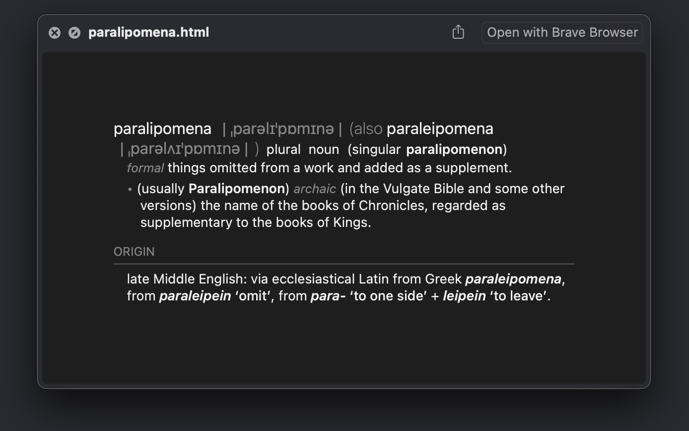

<h1 align="center">
	
	 Collected Workflows
</h1>

This is a collection of smaller workflows, experiments, and demonstrations of interesting concepts for writing automations with the [Alfred App](https://www.alfredapp.com/workflows/). 
<!-- If you find my workflows useful, perhaps consider reciprocating with a token of appreciation 🤗 -->  

__Some workflows live in their own repository:__ 
[DEVONthink 3 Portal](https://github.com/zeitlings/alfred-devonthink) | 
[Calendar++](https://github.com/zeitlings/alfred-calendar) | 
[Default Browser](https://github.com/zeitlings/alfred-set-default-browser/)

<!--
<table align="center">
    <td>
          
    </td>
    <td>
        

            Some workflows live in their own repository: 
            <a href="https://github.com/zeitlings/alfred-devonthink">DEVONthink 3 Portal</a> |
            <a href="https://github.com/zeitlings/alfred-calendar">Calendar++</a> |
            <a href="https://github.com/zeitlings/alfred-set-default-browser/">Default Browser</a>
        

    </td>
</table>
-->

  

---

**Table of Contents**

- [1. Workflows](#1-workflows)
  - [1.1. Duden Workflow](#11-duden-workflow)
  - [1.2. What Unicode character is this?](#12-what-unicode-character-is-this)
  - [1.3. Roman Numeral Converter](#13-roman-numeral-converter)
  - [1.4. DEVONthink ←→ PDF Expert](#14-devonthink--pdf-expert)
  - [1.5. Define Word - A Better Dictionary](#15-define-word---a-better-dictionary)
  - [1.6. AlfredOCR](#16-alfredocr)
  - [1.7. Favorites](#17-favorites)
  - [1.8. New File](#18-new-file)
  - [1.9. Keyboard Brightness](#19-keyboard-brightness)
- [2. Proof of Concept \& Demos](#2-proof-of-concept--demos)
  - [2.1. Extended Hotkeys](#21-extended-hotkeys)
  - [2.2. Permission Handler](#22-permission-handler)

---

# 1. Workflows 

## 1.1. Duden Workflow

<table> 
    <tr>
        <td>
             
        </td>
        <td>
           Search, navigate and view information from duden.de German spelling dictionary. 
        </td>
    </tr>
</table>

- ` shift ⇧ ` or `cmd ⌘+Y`: Get QuickLook previews for the landing page, grammar, and synonyms
- `cmd ⌘+L` to view the full entry contents.
- Action synonymes to list all synonyms. Action any synonym to view the entry for it.
- Action examples or idioms to list all that are available.

**Credits**

- [SwiftSoup](https://github.com/scinfu/SwiftSoup)

---
<!-- What Unicode Character is this? (ツ)_/¯ -->
## 1.2. What Unicode character is this?

<table> 
    <tr>
        <td>
             
        </td>
        <td>
            The <i>What Unicode character is this?</i> workflow tells you which unicode character it is. Given a character or string, you will get the unicode code points, the scalar names and general categories.
        </td>
    </tr>
</table>

### Example `ツ`

- KATAKANA LETTER TU
- `U+30C4`
- Other Letter

### Modifiers

- `⌘ cmd` yields `\u{30C4}` (swift, ES6 formatted)
- `⌥ opt` yields `\u30C4` (python, go formatted)
- `⌃ ctrl` yields `&#x30C4;` (HTML entity)
- `⇧ shift` yields `0x30C4` (hex literal)

### Inverse

Given a hex value either raw or in any of the above formattings will return its corresponding unicode character.
- `whatisit? \u{1F914}` yields info for 🤔

---

## 1.3. Roman Numeral Converter

Convert Roman numerals to decimal and vice versa. Accepts Arabic numbers in the range 1 to 3999.

---

## 1.4. DEVONthink ←→ PDF Expert

<table>
    <tr>
        <td>
            
        </td>
        <td>
            Get either the DEVONthink 3 reference URL from PDF Expert, that is the <code>x-devonthink-item</code> page link for the active document opened in PDF Expert, the <i>selection link</i> if you have text selected, or the <i>annotation link</i> if your selection intersects an annotation and checking for annotations is enabled.
        </td>
    </tr>
</table>

The PDF, of course, has to live in one of your open DEVONthink databases. 
- `cmd ⌘` to open the PDF on the same page in DEVONthink
- `.xdev` to enable or disable opening the document in DEVONthink when using the hotkey

**Expected result A**  
`x-devonthink-item://1D7FA99A-AAFF-4883-9853-F0666A650400?page=6`  
**Expected result B**  
`x-devonthink-item://1D7FA99A-AAFF-4883-9853-F0666A650400?page=6&start=66&length=9&search=selection`  
**Expected result C**  
`x-devonthink-item://1D7FA99A-AAFF-4883-9853-F0666A650400?page=6&annotation=Squiggly&x=212&y=406`

### Known issues

- Fails with documents opened in PDF Expert split view

https://user-images.githubusercontent.com/25689591/218268102-3c07c799-4906-4d2b-9e55-38691f6b0a34.mp4

<!-- https://user-images.githubusercontent.com/25689591/216837085-fa114af5-ab98-4c1c-a866-a44725b4578a.mp4 -->

<!--

  
Expand to watch a preview 👓

  https://user-images.githubusercontent.com/25689591/216837085-fa114af5-ab98-4c1c-a866-a44725b4578a.mp4

    
-->

## 1.5. Define Word - A Better Dictionary

<table>
    <tr>
        <td>
            
        </td>
        <td>
            Customizable Dictionary with Quicklook Preview - and Dark Mode.
        </td>
    </tr>
</table>

`ctrl` to see the dictionary associated with the entry  
`cmd + ⏎` to paste a word to the frontmost application (spell checker)  
`shift` or `cmd+Y` to preview the dictionary entry  
`cmd+C` to copy the dictionary entry's plain text to the clipboard  
`cmd+L` to view the plain text as large type  

You can define dictionaries for lookups, set the font size of the previews, or manually select a dictionary to use. The previews reflect the global appearance, i.e. they have a dark mode. The workflow also includes a preset for looking up synonyms of a word and a convenient keyboard shortcut for quick lookups. To use the workflow as a multilingual spell checker, you can use the `cmd` modifier when actioning the entry to paste the word to the frontmost application.

## 1.6. AlfredOCR

_No external dependencies are required to perform the OCR._

### 1.6.1 AlfredOCR Light

<table>
    <tr>
        <td>
            
        </td>
        <td>
            The workflow allows you to <b>copy text from images</b> using optical character recognition. Take a snapshot with your mouse or trackpad and the recognized text is automatically copied to the clipboard.
        </td>
    </tr>
</table>

### 1.6.2 AlfredOCR+

<table>
    <tr>
        <td>
            
        </td>
        <td>
            The workflow allows you to <b>copy text from images</b> and to <b>convert PDFs to searchable PDF documents</b> using optical character recognition. Includes a progress tracker for the document recognition process.
        </td>
    </tr>
</table>

__A. Snapshot__  
Take a snapshot with your mouse or trackpad and the recognized text is automatically copied to the clipboard. 
- Default shortcut: <kbd>⌘</kbd> <kbd>⇧</kbd> <kbd>6</kbd>
- Default keyword: `ocr`

__B. PDF Document__
- To convert a PDF into a searchable PDF document, pass it to the workflow's [Universal Action](https://www.alfredapp.com/help/features/universal-actions/). 
- To force the replacement of a specific source document, pass it to the Universal Action while holding down the <kbd>⌘</kbd> key.
- To view the **progress tracker**, re-enable the workflow with the keyword (default: `ocr`).

## 1.7. Favorites

<table>
    <tr>
        <td>
            
        </td>
        <td>
            
Add files and folders to your list of favorites by using the workflow's <a href="https://www.alfredapp.com/help/features/universal-actions/">Universal Action</a>. Quickly find them again by activating the workflow with the <code>Keyword</code> (default: <code>fav</code>) or by setting a hotkey of your choice.

        </td>
    </tr>
</table>

- Hit `enter` or `cmd+O` to open a file or folder.
- Add items with the workflow’s [Universal Action](https://www.alfredapp.com/help/features/universal-actions/).
- **Modifiers:**
	- `ctrl`: Show full Path
	- `cmd`: Reveal in Finder
	- `opt`: Browse in Alfred
	- `cmd+shift`: Move up
	- `opt+shift`: Move down
	- `fn`: Remove from Favorites
	- `shift` or `cmd+Y`: Quicklook Preview

## 1.8. New File

<table>
    <tr>
        <td>
            
        </td>
        <td>
            
The workflow allows you to quickly create new files in the Finder.

            
If the <em>post-haste</em> behavior is enabled, new files are created the same way as folders are when you use the shortcut (default: <code>⌥+⇧+N</code>). Otherwise you will be prompted with the input mask where you can configure the file name and type.
        
        </td>
    </tr>
</table>

The workflow will pick up on your location in the Finder and create the new file there. If you use the keyword, the most recently used Finder window will be selected as the destination. If no Finder window is currently open, the file will be created in the configurable fallback location.

__Bonus:__ In addition to all plain-text type files, the workflow can also quickly create `docx`, `doc`, `odt`, `rtf` and `rtfd` documents for you.

__Modifiers__
- Hold **⌘** to view the full file path.
- Hold **⌘+⇧** before hitting enter to enforce creating the file **with clipboard** contents.
- Hold **⌥+⇧** before hitting enter to enforce creating the file **without clipboard** contents.

## 1.9. Keyboard Brightness

<table>
    <tr>
        <td>
            
        </td>
        <td>
            
Adjust the keyboard brightness either by using the keyword or by setting up custom shortcuts.

            
When using the keyword
                <ul>
                <li> type <kbd>></kbd> to increase the brightness</li>
                <li> type <kbd><</kbd> to decrease the brightness</li>
                </ul>
            

        </td>
    </tr>
</table>

---

# 2. Proof of Concept & Demos

<!--  -->

## 2.1. Extended Hotkeys

__Modifier Palettes & Double Tap Hotkeys.__ Proof of concept and demo implementation of modifier palettes to invoke actions on consecutive keystrokes in Alfred.

Modifier Palette example behavior. 
- `⌥O`, `⌥K` To trigger action A.  
- `⌥I`, `⌥K` To trigger action B.

Double-Tap Hotkey example behavior  
- `⌃+`, `⌃+` To trigger action.

### Some Details

The core idea is to inject environment variables into the workflow configuration and to modify them with some delay.

- To set up modifier palettes, all you have to do is define an identifier on any hotkey, `⌥O`, such as "`openA`". This is the "text" argument that the hotkey passes on as `{query}`. Set the identifier to some *environment* variable, say "`gate`", and use a downstream `conditional object` triggered by a different hotkey, `⌥K`, to check if the variable (`{var:gate}`) is equal to the identifier `openA`. Any action that you make depend on this condition will be triggered iff `gate` is equal to `openA`, i.e. if you have recently tapped the hotkey associated with the identifier.

- To set up double-tap hotkeys, proceed in the same way, defining an identifier for the hotkey's "text" argument. For each double tap hotkey, an environment variable is injected that is either `0` or `1` for inactive or active. 
	

`Disclaimer`: Alfred may crash if you get the timing of the keystrokes just right. This is due to a data race where the same variable ("`gate`") is accessed and modified by different threads at the same time. Also, for the double-tap hotkeys, there is some "bleed" into the other hotkeys with the way it is set up in the demo. Tapping a, then b, will also trigger b, instead of having to tap b twice.

---

## 2.2. Permission Handler 

An example of how to handle permissions gracefully for your executables. (For now, take a look at the *Duden Workflow* that implements the permission handler).

