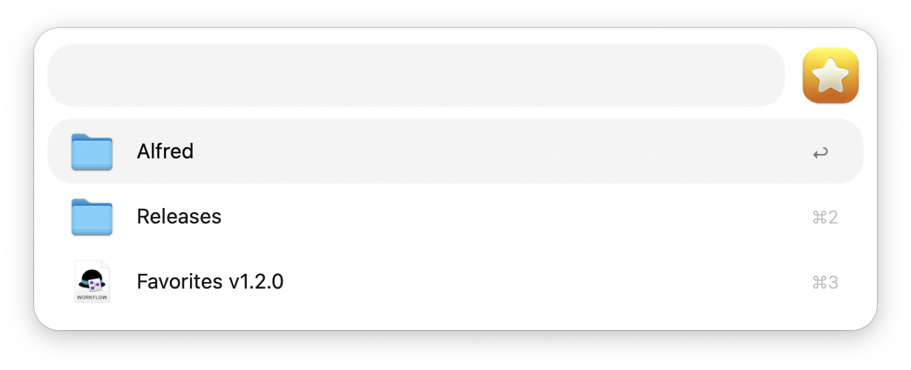
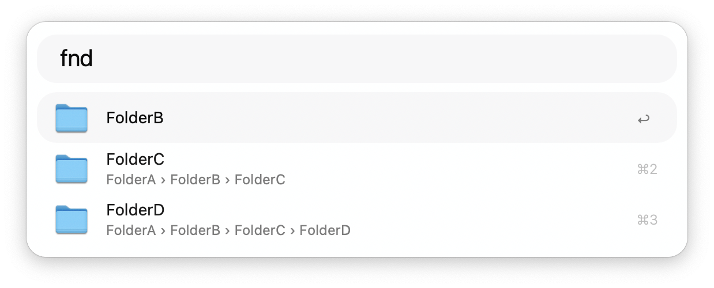
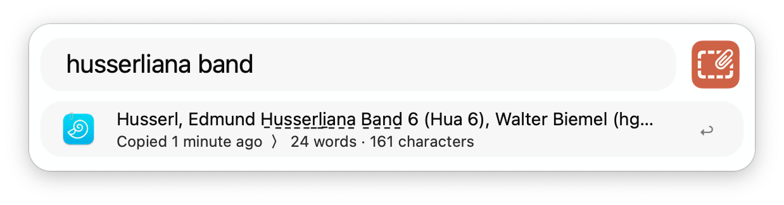

<h1 align="center">
	
	 Collected Workflows
</h1>

This is a collection of smaller workflows, experiments, and demonstrations of interesting concepts for writing automations with the [Alfred App](https://www.alfredapp.com/workflows/).
<!-- If you find my workflows useful, perhaps consider reciprocating with a token of appreciation 🤗 -->

__Some workflows live in their own repository:__
- [µBib | Citations, BibTeX, and Research](https://github.com/zeitlings/ubib)
- [Quill | Text processing utility](https://github.com/zeitlings/alfred-quill)
- [Ayai · GPT Nexus (alpha)](https://github.com/zeitlings/ayai-gpt-nexus)
- [DEVONthink 4 Portal](https://github.com/zeitlings/alfred-devonthink) 
- [Logseq Workflow](https://github.com/zeitlings/alfred-logseq)
- [Ollama Workflow](https://github.com/zeitlings/alfred-ollama) 
- [Default Browser](https://github.com/zeitlings/alfred-set-default-browser/)
- [Unified Search](https://github.com/zeitlings/alfred-unified-search) 
- [Calendar++](https://github.com/zeitlings/alfred-calendar) 

<!--
<table align="center">
    <td>
        
    </td>
    <td>
        

            Some workflows live in their own repository: 
            <a href="https://github.com/zeitlings/alfred-devonthink">DEVONthink 3 Portal</a> |
            <a href="https://github.com/zeitlings/alfred-calendar">Calendar++</a> |
            <a href="https://github.com/zeitlings/alfred-set-default-browser/">Default Browser</a>
        

    </td>
</table>
-->

---

**Table of Contents**

- [1. Workflows](#1-workflows)
  - [1.1. Duden Workflow](#11-duden-workflow)
  - [1.2. What Unicode character is this?](#12-what-unicode-character-is-this)
  - [1.3. Roman Numeral Converter](#13-roman-numeral-converter)
  - [1.4. DEVONthink ←→ PDF Expert](#14-devonthink--pdf-expert)
  - [1.5. Define Word - A Better Dictionary](#15-define-word---a-better-dictionary)
  - [1.6. AlfredOCR](#16-alfredocr)
  - [1.7. Favorites](#17-favorites)
  - [1.8. New File](#18-new-file)
  - [1.9. Keyboard Brightness](#19-keyboard-brightness)
  - [1.10. GIF from Video](#110-gif-from-video)
  - [1.11. Bluetooth Device Battery](#111-bluetooth-device-battery)
  - [1.12. QResolve](#112-qresolve)
  - [1.13. GIF from Images](#113-gif-from-images)
  - [1.14 Extract Keywords](#114-extract-keywords)
  - [1.15 Color Picker](#115-color-picker)
  - [1.16 PDF to Text](#116-pdf-to-text)
  - [1.17 PDF Split](#117-pdf-split)
  - [1.18 PDF Compress](#118-pdf-compress)
  - [1.19 Scratchpad](#119-scratchpad)
  - [1.20 Window Navigator](#120-window-navigator)
  - [1.21 Fuzzy Search](#121-fuzzy-search)
  - [1.22 PDF to Table](#122-pdf-to-table)
  - [1.23 PDF to Docx](#123-pdf-to-docx)
  - [1.24 Internet Speedtest](#124-internet-speedtest)
  - [1.25 Image Compression](#125-image-compression)
  - [1.26 Finder Crawl](#126-finder-crawl)
  - [1.27 DNS Selector](#127-dns-selector)
  - [1.28 Edit Clipboard](#128-edit-clipboard)
  - [1.29 Grep this!](#129-grep-this)
  - [1.30 File, Please](#130-file-please)
- [2. Proof of Concept \& Demos](#2-proof-of-concept--demos)
  - [2.1. Extended Hotkeys](#21-extended-hotkeys)
  - [2.2. Permission Handler](#22-permission-handler)
  - [2.3. GUI Input Experiment](#23-gui-input-experiment)
  - [2.4. Heads-up Display](#24-heads-up-display)

---

# 1. Workflows

## 1.1. Duden Workflow

<table>
    <tr>
        <td>
            
        </td>
        <td>
           Search, navigate and view information from duden.de German spelling dictionary.
        </td>
    </tr>
</table>

- ` shift ⇧ ` or `cmd ⌘+Y`: Get QuickLook previews for the landing page, grammar, and synonyms
- `cmd ⌘+L` to view the full entry contents.
- Action synonymes to list all synonyms. Action any synonym to view the entry for it.
- Action examples or idioms to list all that are available.

**Credits:**  [SwiftSoup](https://github.com/scinfu/SwiftSoup)

---
<!-- What Unicode Character is this? (ツ)_/¯ -->
## 1.2. What Unicode character is this?

<table>
    <tr>
        <td>
            
        </td>
        <td>
            The <i>What Unicode character is this?</i> workflow tells you which unicode character it is. Given a character or string, you will get the unicode code points, scalar names, and general categories.
        </td>
    </tr>
</table>

### Usage

- <kbd>↩</kbd> Copy | Paste the Unicode character
- <kbd>⌘</kbd><kbd>↩</kbd> Copy | Paste the Swift, ES6 formatted code unit (e.g. `\u{30C4}`)
- <kbd>⌥</kbd><kbd>↩</kbd> Copy | Paste the Python, Go-lang formatted code unit (e.g. `\u30C4`)
- <kbd>⇧</kbd><kbd>↩</kbd> Copy | Paste the hex literal (e.g. `0x30C4`)
- <kbd>⌃</kbd><kbd>↩</kbd> Copy | Paste the HTML numerical reference (e.g. `&#12484;`)
- <kbd>⌃</kbd><kbd>⇧</kbd><kbd>↩</kbd> Copy | Paste the HTML hex reference (e.g. `&#x30C4;`)
- <kbd>⌘</kbd><kbd>⇧</kbd><kbd>↩</kbd> Copy | Paste the HTML named entity (e.g. `&amp;`)
- <kbd>⌥</kbd><kbd>⇧</kbd><kbd>↩</kbd> Copy | Paste the URL encoded representation (e.g. `%20`)

### Inverse

Given a hex value, either raw or in one of the above formats, will return its corresponding Unicode character. For example, `whatisit? \u{1F914}` returns the info for 🤔

---

## 1.3. Roman Numeral Converter

<table>
    <tr>
        <td>
            
        </td>
        <td>
            Convert Roman numerals to decimal and vice versa. Accepts Arabic numbers in the range 1 to 3999.
        </td>
    </tr>
</table>

---

## 1.4. DEVONthink ←→ PDF Expert

<table>
    <tr>
        <td>
            
        </td>
        <td>
            Get either the DEVONthink 3 reference URL from PDF Expert, that is the <code>x-devonthink-item</code> page link for the active document opened in PDF Expert, the <i>selection link</i> if you have text selected, or the <i>annotation link</i> if your selection intersects an annotation and checking for annotations is enabled.
        </td>
    </tr>
</table>

The PDF, of course, has to live in one of your open DEVONthink databases.
- `cmd ⌘` to open the PDF on the same page in DEVONthink
- `.xdev` to enable or disable opening the document in DEVONthink when using the hotkey

**Expected result A**
`x-devonthink-item://1D7FA99A-AAFF-4883-9853-F0666A650400?page=6`
**Expected result B**
`x-devonthink-item://1D7FA99A-AAFF-4883-9853-F0666A650400?page=6&start=66&length=9&search=selection`
**Expected result C**
`x-devonthink-item://1D7FA99A-AAFF-4883-9853-F0666A650400?page=6&annotation=Squiggly&x=212&y=406`

### Known issues

- Fails with documents opened in PDF Expert split view

https://user-images.githubusercontent.com/25689591/218268102-3c07c799-4906-4d2b-9e55-38691f6b0a34.mp4

<!-- https://user-images.githubusercontent.com/25689591/216837085-fa114af5-ab98-4c1c-a866-a44725b4578a.mp4 -->

<!--

  
Expand to watch a preview 👓

  https://user-images.githubusercontent.com/25689591/216837085-fa114af5-ab98-4c1c-a866-a44725b4578a.mp4

-->

## 1.5. Define Word - A Better Dictionary

<table>
    <tr>
        <td>
            
        </td>
        <td>
            Customizable Dictionary with Quicklook Preview - and Dark Mode.
        </td>
    </tr>
</table>

`shift` or `cmd+Y` to preview the dictionary entry
`ctrl` to see the dictionary associated with the entry
`cmd + ⏎` to paste a word to the frontmost application (spell checker)
`cmd+C` to copy the dictionary entry's plain text to the clipboard
`cmd+L` to view the plain text as Large Type

You can define dictionaries for lookups, set the font size of the previews, or manually select a dictionary to use. The previews reflect the global appearance, i.e. they have a dark mode. The workflow also includes a preset for looking up synonyms of a word and a convenient keyboard shortcut for quick lookups. To use the workflow as a multilingual spell checker, you can use the `cmd` modifier when actioning the entry to paste the word to the frontmost application.

## 1.6. AlfredOCR

_No external dependencies are required to perform the OCR._

### 1.6.1 Alfred OCR Light

<table>
    <tr>
        <td>
            
        </td>
        <td>
            The workflow allows you to <b>copy text from images</b> using optical character recognition. Take a snapshot with your mouse or trackpad and the recognized text is automatically copied to the clipboard. You can also extract text from images sent to the workflow's <a href="https://www.alfredapp.com/help/workflows/triggers/file-action/">File Action</a>.
        </td>
    </tr>
</table>

### 1.6.2 Alfred OCR+

<table>
    <tr>
        <td>
            
        </td>
        <td>
            The workflow allows you to <strong>copy text from images</strong>, or to <strong>convert PDF files into searchable PDF documents</strong> using optical character recognition, and to apply compression to PDF documents.
        </td>
    </tr>
</table>

__1 / Snapshot__
Take a snapshot with your mouse or trackpad and the recognized text is automatically copied to the clipboard.
- Default shortcut: <kbd>⌘</kbd> <kbd>⇧</kbd> <kbd>6</kbd>
- Default keyword: `ocr`

__2 / PDF Document__

- To convert a PDF into a searchable PDF document, pass it to the workflow's *[Universal Action](https://www.alfredapp.com/help/features/universal-actions/)*.
	- To compress the resulting PDF, pass the source document on while pressing the **⌘+⇧** keys.
	- To open the resulting PDF, pass the source document on while pressing the **⌥+⇧** keys.
	- To force the replacement of a source document, pass it on while pressing the **⌥+⌘** keys.

- To compress a PDF without performing OCR, pass it to the `Compress PDF Document` File Action.
- To view the **progress tracker**, re-enable the workflow with the `Keyword` (default: `ocr`).

## 1.7. Favorites

<table>
    <tr>
        <td>
            
        </td>
        <td>
            
Add files and folders to your list of favorites by using the workflow's <a href="https://www.alfredapp.com/help/features/universal-actions/">Universal Action</a>. Quickly find them again by activating the workflow with the <code>Keyword</code> (default: <code>fav</code>) or by setting a hotkey of your choice.

        </td>
    </tr>
</table>

- <kbd>↩</kbd> Open file or folder.
- <kbd>⌘</kbd><kbd>↩</kbd> Reveal in Finder.
- <kbd>⌥</kbd><kbd>↩</kbd> Browse in Alfred.
- <kbd>fn</kbd><kbd>↩</kbd> Remove from favorites.
- <kbd>⌘</kbd><kbd>Y</kbd> (or tap <kbd>⇧</kbd>) Quicklook Preview.
- <kbd>⌘</kbd><kbd>⇧</kbd><kbd>↩</kbd> Move item up in the list.
- <kbd>⌥</kbd><kbd>⇧</kbd><kbd>↩</kbd> Move item down in the list.

## 1.8. New File

<table>
    <tr>
        <td>
            
        </td>
        <td>
            
The workflow allows you to quickly create new files in the Finder.

            
If the <em>post-haste</em> behavior is enabled, new files are created the same way as folders are when you use the shortcut (default: <code>⌥+⇧+N</code>). Otherwise you will be prompted with the input mask where you can configure the file name and type.

        </td>
    </tr>
</table>

The workflow will pick up on your location in the Finder and create the new file there. If you use the keyword, the most recently used Finder window will be selected as the destination. If no Finder window is currently open, the file will be created in the configurable fallback location.

__Bonus:__ In addition to all plain-text type files, the workflow can also quickly create `docx`, `doc`, `odt`, `rtf` and `rtfd` documents and Xcode `playground`s.

__Creating a new file__
- <kbd>⌘</kbd> to view the full path to the target folder.
- <kbd>↩</kbd> to create the file with configured settings.
- <kbd>⌘</kbd><kbd>⇧</kbd><kbd>↩</kbd> to create the file **with clipboard** contents.
- <kbd>⌥</kbd><kbd>⇧</kbd><kbd>↩</kbd> to create the file **without clipboard** contents.

If auto-suggest is enabled, press <kbd>TAB</kbd> to accept and expand the suggested filename. 

## 1.9. Keyboard Brightness

<table>
    <tr>
        <td>
            
        </td>
        <td>
            
Adjust the keyboard backlight brightness either by using the keyword or by setting up custom shortcuts.

            
When using the keyword
                <ul>
                <li> type <kbd>></kbd> or <kbd>+</kbd> to increase the brightness</li>
                <li> type <kbd><</kbd> or <kbd>-</kbd> to decrease the brightness</li>
                </ul>
            

        </td>
    </tr>
</table>

## 1.10. GIF from Video

<table>
    <tr>
        <td>
            
        </td>
        <td>
            
The workflow allows you to convert video of popular formats to animated GIFs. To do this, it uses <a href="https://ffmpeg.org/">ffmpeg</a> as a dependency.

        </td>
    </tr>
</table>

### Usage

Either send a video to the workflow's [*File Action*](https://www.alfredapp.com/help/workflows/triggers/file-action/) or invoke the workflow using the keyword and search for the video file you want to convert. Then select the image size you want the resulting GIF to have from the list to start the conversion.

## 1.11. Bluetooth Device Battery

<table>
    <tr>
        <td></td>
        <td>View the battery charge status of connected Bluetooth devices (macOS 13.0+). Install Apple's <a href="https://developer.apple.com/fonts/">SF Pro font</a> to see the icons.</td>
    </tr>
</table>

## 1.12. QResolve

<table>
    <tr>
        <td></td>
        <td>Resolve and open links from QR codes</td>
    </tr>
</table>

### Usage

**A /** Take a snapshot of the QR code you want to open the link to
- Default keyword: `qrr`
- Recommended shortcut: **⌘+⇧+7**

**B /** Send an image containing the QR code to the workflow's [File Action](https://www.alfredapp.com/help/workflows/triggers/file-action/)

## 1.13. GIF from Images

<table>
    <tr>
        <td>
            
        </td>
        <td>
            

            The workflow allows you to convert a series of still images into animated GIFs. For this, it uses <a href="https://imagemagick.org/">ImageMagick</a> as a dependency.
        </td>
    </tr>
</table>

### Usage

Send a series of still images to the workflow's [*File Action*](https://www.alfredapp.com/help/workflows/triggers/file-action/) to create an animated GIF. The smallest image determines the dimensions of the result. All source images are assumed to be of the same file type, e.g. jpg or png.

## 1.14 Extract Keywords

<table>
    <tr>
        <td>
            
        </td>
        <td>
            

            Extract keywords and keyphrases from articles, books or other documents with <a href="https://github.com/LIAAD/yake/">YAKE!</a>
        </td>
    </tr>
</table>

### Usage

- Send `PDF`, `docx`, `doc`, `rtf` or `txt` documents to the workflow's File Actions
- Pass the text from your selection in macOS on to the workflow's Universal Action
- Use the keyword and paste your text (default: `kw`)

### Dependencies

The workflow relies on **Python3** to install the YAKE standalone.

#### YAKE!
- `pip install git+https://github.com/LIAAD/yake`
- [official installation guide](https://github.com/LIAAD/yake/#option-3-standalone-installation-for-development-or-integration)

#### pdftotext
- `brew install poppler`
- [formula on brew.sh](https://formulae.brew.sh/formula/poppler)

## 1.15 Color Picker

 

<table>
    <tr>
        <td>
            
        </td>
        <td>
            
Pick a color to get its hex, rgba, hsl representation or NSColor initializer.

        </td>
    </tr>
</table>

### Usage

Activate the *Color Sampler* with the keyword (default: `cp`) and pick the desired color.

### Color History

To review previously picked colors, activate the workflow with the keyword preceded by a colon (default: `:cp`).

## 1.16 PDF to Text

<table>
    <tr>
        <td>
            
        </td>
        <td>
            Extract text from PDF documents.
        </td>
    </tr>
</table>

### Usage

Extract the entire text from one or more PDFs by sending them to the workflow's [File Action](https://www.alfredapp.com/help/workflows/triggers/file-action/) or locate a PDF with the [File Filter](https://www.alfredapp.com/help/workflows/inputs/file-filter/) by using the keyword (default: `pdftotext`). To extract the text from specific pages of a single document, use the <kbd>⌘</kbd> modifier. The result will be exported as a plain text document.

#### File Filter

- <kbd>↩</kbd> Proceed to extract the entire text.
- <kbd>⌘</kbd><kbd>↩</kbd> Proceed by specifing the pages to extract.
- <kbd>⌃</kbd><kbd>↩</kbd> Proceed, push the result to the [File Buffer](https://www.alfredapp.com/help/features/file-search/#file-buffer) and [action it in Alfred](https://www.alfredapp.com/help/features/universal-actions/).

#### File Action

- <kbd>↩</kbd> Proceed to extract the entire text.
- <kbd>⌘</kbd><kbd>↩</kbd> Proceed by specifing the pages to extract (single file only).
- <kbd>⌃</kbd><kbd>↩</kbd> Proceed, push the result(s) to the [File Buffer](https://www.alfredapp.com/help/features/file-search/#file-buffer) and [action them in Alfred](https://www.alfredapp.com/help/features/universal-actions/).

#### Specifying the Pages

- <kbd>↩</kbd> Proceed to extract text from the specified pages.
- <kbd>⌘</kbd><kbd>↩</kbd> Preview the first and last PDF pages w/ Alfred's PDF View.
- <kbd>⌥</kbd><kbd>↩</kbd> Preview the contents of the first and last page w/ Alfred's Text View.
- <kbd>⌃</kbd><kbd>↩</kbd> Proceed, push the result to the [File Buffer](https://www.alfredapp.com/help/features/file-search/#file-buffer) and [action it in Alfred](https://www.alfredapp.com/help/features/universal-actions/).

Press <kbd>↩</kbd> to return to the view where you can set the start and end pages.

### Dependencies

- With [Homebrew](https://brew.sh/) install
- Poppler: `brew install poppler`

## 1.17 PDF Split

<table>
    <tr>
        <td>
            
        </td>
        <td>
            Easily extract a specific page range from an existing PDF document and create a new PDF file with the selected pages.
        </td>
    </tr>
</table>

### Usage

Either invoke the workflow by using the keyword (default: `pdfsplit`) and locate a PDF, or send a PDF to the workflow's [File Action](https://www.alfredapp.com/help/workflows/triggers/file-action/). Specify the start and end pages of the range you want to be extracted. The specified first and last page can be previewed by pressing the <kbd>⌘</kbd> modifier.

#### Specifying the Pages

- <kbd>↩</kbd> Proceed to extract text from the specified pages.
- <kbd>⌘</kbd><kbd>↩</kbd> Preview the first and last PDF pages w/ Alfred's PDF View.
- <kbd>⌥</kbd><kbd>↩</kbd> Proceed, push the result to the [File Buffer](https://www.alfredapp.com/help/features/file-search/#file-buffer) and [action it in Alfred](https://www.alfredapp.com/help/features/universal-actions/).

Press <kbd>↩</kbd> to return to the view where you can set the start and end pages.

### Dependencies

- With [Homebrew](https://brew.sh/) install
- Poppler: `brew install poppler`

## 1.18 PDF Compress

<table>
    <tr>
        <td>
            
        </td>
        <td>
            Compress PDF documents.
        </td>
    </tr>
</table>

### Usage

Either invoke the workflow by using the keyword (default: `pdfcompress`) and locate a PDF, or send a PDF to the workflow's "Compress PDF Document" [File Action](https://www.alfredapp.com/help/workflows/triggers/file-action/).

A compression preset can be selected by pressing <kbd>⌥</kbd> before proceeding with <kbd>↩</kbd>.

#### File Filter

- <kbd>↩</kbd> Proceed to compress the PDF using the default strategy.
- <kbd>⌥</kbd><kbd>↩</kbd> Select a compression preset.

#### File Action

- <kbd>↩</kbd> Proceed to compress the PDF using the default strategy.
- <kbd>⌥</kbd><kbd>↩</kbd> Select a compression preset.

#### Compression Presets

- <kbd>↩</kbd> Proceed to compress the PDF using the selected strategy.

The result will be a compressed document in the same location as the source PDF file.

### Dependencies

- With [Homebrew](https://brew.sh/) install
- Ghostscript: `brew install gs`

## 1.19 Scratchpad

<table>
    <tr>
        <td>
            
        </td>
        <td>
            

            Quickly access up to 9 scratchpads for spontaneous note-taking.  🟡 🟠 🔴 🟣 🔵 🟢
            

        </td>
    </tr>
</table>

### Usage

Press the keyboard shortcut to open the scratchpad that was last used.
Press the keyboard shortcut again or <kbd>⎋</kbd> to dismiss the scratchpad without saving.

In __Editing Mode__
* <kbd>⌘⏎</kbd> to save changes¹
* <kbd>⇧⏎</kbd> to preview as rendered markdown
* <kbd>⌥⏎</kbd> to view all pads and search your notes²
* <kbd>⌘⇧⏎</kbd> to cycle through your scratchpads

In __Markdown Mode__
* <kbd>⏎</kbd> or <kbd>⇧⏎</kbd> to start editing
* <kbd>⌥⏎</kbd> to view all pads and search your notes²
* <kbd>⌘⇧⏎</kbd> to cycle through your scratchpads
* <kbd>⎋</kbd> to either cancel or go back through previously viewed pads

Press the secondary keyboard shortcut or enter the workflow's keyword (default: `pad`) to view all scratchpads and to search their contents.

__Notes:__
¹  Changes are also saved when previewing and when switching the active pad.
²  When searching for a pad containing a keyword, the first matching line will be used as subtitle. Press <kbd>⌘L</kbd> to view the matched line as [Large Type](https://www.alfredapp.com/help/features/large-type/).

## 1.20 Window Navigator

  

<table>
    <tr>
        <td>
            
        </td>
        <td>
            

            Navigate to any window of the currently focused application or any application across all desktops, or switch windows within the current desktop space.
            

        </td>
    </tr>
</table>

<!--
> [!NOTE]
> macOS 15  deprecates an API that Window Navigator uses to retrieve window information. Already compiled executables will continue to work as expected, but compilation will fail if you try to run the workflow for the first time with macOS 15.
> I'm investigating a solution to this problem.
-->

### Usage

1. Search the windows of the active app globally using the Navigator keyword.
2. Search app windows in the current desktop space using the Switcher keyword.
3. Search all visible windows of all apps globally using the Global keyword.
* <kbd>↩</kbd> to navigate to the selected window.
* <kbd>⌘</kbd><kbd>↩</kbd> to close the selected window.
* <kbd>⌥</kbd><kbd>↩</kbd> to quit the owning application.

#### 1. Navigator

#### 2. Switcher

#### 3. Global

## 1.21 Fuzzy Search

<table>
    <tr>
        <td>
            
        </td>
        <td>
            Limited scope fuzzy search.
            <ul>
                <li>use <b>fzf</b> for classic matching</li>
                <li>use <b>fzf-abbrev</b> for initial character matching</li>
            </ul>
        </td>
    </tr>
</table>

## 1.22 PDF to Table

<table>
    <tr>
        <td>
            
        </td>
        <td>
            Extract tables from PDF documents as CSV.
        </td>
    </tr>
</table>

### Usage

Extract tables from PDFs via the [Universal Action](https://www.alfredapp.com/help/features/universal-actions) and export them as CSV.
- Use __PDF to Table (Lattice)__ if there are ruling lines separating each cell
- Use __PDF to Table (Stream)__ if there are no ruling lines separating each cell

<!-- PDF to Table Universal Action preview image --->

<!-- PDF to Table Lattice resulting CSV Quicklook preview image --->

### Dependencies

- [Java](https://www.java.com/en/download/help/mac_install.html) (Information on installing Java)
	* [Java for macOS download page](https://www.java.com/en/download/)
- [Tabula](https://github.com/tabulapdf/tabula-java) (The jar file is included in this workflow)

## 1.23 PDF to Docx

<table>
    <tr>
        <td>
            
        </td>
        <td>
            Convert PDFs to Word documents.
        </td>
    </tr>
</table>

### Setup

- Install [pdf2docx](https://github.com/ArtifexSoftware/pdf2docx) via the command line: `pip install pdf2docx`

### Usage

Convert PDFs to Word documents (docx) via the [Universal Action](https://www.alfredapp.com/help/features/universal-actions).

<!-- PDF to Docx Universal Action preview image -->

## 1.24 Internet Speedtest

<table>
    <tr>
        <td>
            
        </td>
        <td>
            Test your internet connection speed via the <code>speedtest</code> keyword.
        </td>
    </tr>
</table>

### Usage

- <kbd>⏎</kbd> Start the Speedtest
- <kbd>⌘</kbd><kbd>⏎</kbd> Start the Speedtest [sequentially | in parallel]

- <kbd>⌘</kbd><kbd>⏎</kbd> Rerun the Speedtest
- <kbd>⌘</kbd><kbd>⇧</kbd><kbd>⏎</kbd> Rerun the Speedtest [sequentially | in parallel]

## 1.25 Image Compression

<table>
    <tr>
        <td>
            
        </td>
        <td>
            The workflow is designed for aggressive compression, minimizing file size while preserving essential image quality details.
        </td>
    </tr>
</table>

### Usage

Compress one or more images via the [Universal Action](https://www.alfredapp.com/help/features/universal-actions) and replace the original if the file size was reduced.

### Dependencies
- __[pngquant](https://formulae.brew.sh/formula/pngquant#default)__ for PNG compression
- __[oxipng](https://formulae.brew.sh/formula/oxipng#default)__ for further PNG optimization
- __[jpegoptim](https://formulae.brew.sh/formula/jpegoptim#default)__ for JPG compression
- __[webp](https://formulae.brew.sh/formula/webp#default)__ for WEBP compression
- __[gifsicle](https://formulae.brew.sh/formula/gifsicle#default)__ for GIF compression

## 1.26 Finder Crawl

<table>
    <tr>
        <td>
            
        </td>
        <td>
            Find files and folders recursively in the frontmost Finder window.
        </td>
    </tr>
</table>

### Usage

Find files and folders nested within folders of the active Finder window via the `fn` keyword.
Alternatively, use the `fnd` keyword to only search for folders.

 

- <kbd>↩</kbd> Open file or folder
- <kbd>⌘</kbd><kbd>↩</kbd> Reveal file or folder
- <kbd>⌥</kbd><kbd>↩</kbd> Browse in Alfred
- <kbd>⌘</kbd><kbd>L</kbd> View the unabridged file path as [Large Type](https://www.alfredapp.com/help/features/large-type/)
- <kbd>⌃</kbd> View file path

## 1.27 DNS Selector

<table>
    <tr>
        <td>
            
        </td>
        <td>
            Change, test, and compare DNS resolvers, flush the DNS cache, or restore DNS settings to your ISP's defaults. The built-in connectivity test provides a heuristic to gauge DNS responsiveness, helping you pick the fastest resolver for your location or check your preferred resolver’s performance.
        </td>
    </tr>
</table>

### Usage

Change your preferred DNS resolver via the `dns` keyword.

 

- <kbd>⏎</kbd> Change DNS servers
- <kbd>⌘</kbd><kbd>⏎</kbd> Test DNS resolver responsiveness
- <kbd>⌥</kbd><kbd>⏎</kbd> Open the correlating website
- <kbd>⌘</kbd><kbd>⇧</kbd><kbd>⏎</kbd> Ignore DNS resolver
- <kbd>⌥</kbd><kbd>⇧</kbd><kbd>⏎</kbd> Open _dnsperf_ website if available
- <kbd>⌘</kbd><kbd>Y</kbd> (or tap <kbd>⇧</kbd>) Quicklook correlating website
- <kbd>⌘</kbd><kbd>L</kbd> View DNS resolver info as [Large Type](https://www.alfredapp.com/help/features/large-type/)
- <kbd>⌃</kbd> Show description

Additionally, restore DNS settings to your ISP's defaults by using the `dnsreset` keyword, or clear your local DNS cache with the `dnsflush` keyword.

 

Previously ignored services can be recovered via the `:dns` keyword.

- <kbd>⏎</kbd> Recover DNS option
- <kbd>⌘</kbd><kbd>⏎</kbd> Go to the DNS resolver list

## 1.28 Edit Clipboard

<table>
    <tr>
        <td>
            
        </td>
        <td>
            Quickly inspect, edit, and update your clipboard text—no external editor needed.
            <b>Hidden links</b> in text copied from websites or rich text can be <b>converted into Markdown</b> for enhanced visibility. Optionally, the <b>built-in data extractor</b> distills lengthy text into key components—URLs, emails, dates, mobile numbers, addresses, and names—streamlining clutter into a focused overview for rapid insight.
        </td>
    </tr>
</table>

### Usage

Access and edit your clipboard contents via the `edit` keyword. 
Alternatively, use the [Universal Action](https://www.alfredapp.com/help/features/universal-actions/) to edit and copy text to the clipboard.

- <kbd>⏎</kbd> Edit the clipboard
- <kbd>⌘</kbd><kbd>⏎</kbd> Proceed retaining metadata
- <kbd>⌥</kbd><kbd>⏎</kbd> Proceed ignoring metadata

- <kbd>⌘</kbd><kbd>⏎</kbd> Save clipboard
- <kbd>⌥</kbd><kbd>⏎</kbd> Extract data (if available)
- <kbd>⌃</kbd><kbd>⏎</kbd> [Action](https://www.alfredapp.com/help/features/universal-actions/) clipboard text in Alfred
- <kbd>⌘</kbd><kbd>⌥</kbd><kbd>⏎</kbd> Save clipboard and continue
- <kbd>⌘</kbd><kbd>⇧</kbd><kbd>⏎</kbd> Add items from the __integrated clipboard history__

#### Integrated Clipboard History

  

- <kbd>⌘</kbd><kbd>⏎</kbd> (or <kbd>⏎</kbd>) Append to clipboard
- <kbd>⌘</kbd><kbd>⇧</kbd><kbd>⏎</kbd> Prepend to clipboard
- <kbd>⌥</kbd><kbd>⏎</kbd> Append all [buffered clipboard items](https://www.alfredapp.com/help/features/file-search/#file-buffer)
- <kbd>⌥</kbd><kbd>⇧</kbd><kbd>⏎</kbd> Prepend all [buffered clipboard items](https://www.alfredapp.com/help/features/file-search/#file-buffer)
- <kbd>⇧</kbd><kbd>⏎</kbd> Skip and return to editing
- tap <kbd>⇥</kbd> Limit query to selected application applying __clipboard filter__
- <kbd>⌃</kbd> View information if subtext is disabled
- <kbd>⌘</kbd><kbd>Y</kbd> (or tap <kbd>⇧</kbd>) Quick Look the clipboard contents
- <kbd>⌘</kbd><kbd>L</kbd> Preview the clipboard contents as [Large Type](https://www.alfredapp.com/help/features/large-type/)

#### Standalone Clipboard History

Use the *standalone* variant as Alfred clipboard history replacement via the `hist` __History Keyword__, or by defining the dedicated [Hotkey Trigger](https://www.alfredapp.com/help/workflows/triggers/hotkey/). 

- <kbd>⏎</kbd> Paste to frontmost application
- <kbd>⌘</kbd><kbd>⏎</kbd> Inspect and edit clipboard item
- <kbd>⌥</kbd><kbd>⏎</kbd> Action clipboard text in Alfred
- <kbd>⌘</kbd><kbd>C</kbd> Copy to clipboard
- tap <kbd>⇥</kbd> Limit query to selected application applying __clipboard filter__
- <kbd>⌃</kbd> View information if subtext is disabled
- <kbd>⌘</kbd><kbd>Y</kbd> (or tap <kbd>⇧</kbd>) Quick Look the clipboard contents
- <kbd>⌘</kbd><kbd>L</kbd> Preview the clipboard contents as [Large Type](https://www.alfredapp.com/help/features/large-type/)

#### Clipboard Filters

Type the prefix `:::` to filter clipboard items copied from specific applications.  
__Tip:__ Tap <kbd>⇥</kbd> twice to reach the app selector.

- <kbd>⏎</kbd> (or tap <kbd>⇥</kbd>) Limit to clipboard items that originate from the selected application.

## 1.29 Grep this!

<table>
    <tr>
        <td>
            
        </td>
        <td>
            Grep text from folders, files, or plain text to quickly inspect their contents, or help you locate that specific file you know had this particular word in it. 
        </td>
    </tr>
</table>

### Usage

Use the __*Grep this!*__ [Universal Action](https://www.alfredapp.com/help/workflows/triggers/universal-action/) to find lines in your input that match the query.

Alternatively, use the [Hotkey](https://www.alfredapp.com/help/workflows/triggers/hotkey/) to grep your selection in macOS—text, files, or folders—or to search within the __document currently open__ in your IDE or text editor, if that editor is supported.  

Additionally, you can locate files or folders for grepping via the `grep` keyword.

  

  

  

- <kbd>⏎</kbd> Open the file at the matched line and column.

## 1.30 File, Please

<table>
    <tr>
        <td>
            
        </td>
        <td>
            Go to the file. 
        </td>
    </tr>
</table>

### Usage

Quickly go to the file or document open in the frontmost application, or browse the current Finder location via the __primary__ [Hotkey Trigger](https://www.alfredapp.com/help/workflows/triggers/hotkey/).  

The __secondary__ [Hotkeys](https://www.alfredapp.com/help/workflows/triggers/hotkey/) in this workflow allow you to quickly reveal the most recently downloaded file in your Downloads folder, or the file most recently added to the Desktop.

Alternatively, use the `fp`, `fpl`, and `fpd` keywords to get the file you want.

- <kbd>↩</kbd> Get the file using the default strategy
- <kbd>⌘</kbd><kbd>↩</kbd> Get the file using the __Alfred Browser__
- <kbd>⌥</kbd><kbd>↩</kbd> Get the file using the __Command Line__
- <kbd>⌃</kbd><kbd>↩</kbd> Reveal the file in __Finder__

---

# 2. Proof of Concept & Demos

<!--  -->

## 2.1. Extended Hotkeys

__Modifier Palettes & Double Tap Hotkeys.__ Proof of concept and demo implementation of modifier palettes to invoke actions on consecutive keystrokes in Alfred.

Modifier Palette example behavior.
- `⌥O`, `⌥K` To trigger action A.
- `⌥I`, `⌥K` To trigger action B.

Double-Tap Hotkey example behavior
- `⌃+`, `⌃+` To trigger action.

### Details

The core idea is to inject environment variables into the workflow configuration and to modify them with some delay.

- To set up modifier palettes, all you have to do is define an identifier on any hotkey, `⌥O`, such as "`openA`". This is the "text" argument that the hotkey passes on as `{query}`. Set the identifier to some *environment* variable, say "`gate`", and use a downstream `conditional object` triggered by a different hotkey, `⌥K`, to check if the variable (`{var:gate}`) is equal to the identifier `openA`. Any action that you make depend on this condition will be triggered iff `gate` is equal to `openA`, i.e. if you have recently tapped the hotkey associated with the identifier.

- To set up double-tap hotkeys, proceed in the same way, defining an identifier for the hotkey's "text" argument. For each double tap hotkey, an environment variable is injected that is either `0` or `1` for inactive or active.

`Disclaimer`: Alfred may crash if you get the timing of the keystrokes just right. This is due to a data race where the same variable ("`gate`") is accessed and modified by different threads at the same time. Also, for the double-tap hotkeys, there is some "bleed" into the other hotkeys with the way it is set up in the demo. Tapping a, then b, will also trigger b, instead of having to tap b twice.

---

## 2.2. Permission Handler

An example of how to handle permissions gracefully for your executables. (For now, take a look at the *Duden Workflow* that implements the permission handler).

## 2.3. GUI Input Experiment

Run a graphical prompt and read the input. Proof of concept for using NSWindow and SwiftUI components to get user input through a graphical prompt and then use it in the Alfred app - or on the command line.

    
    

## 2.4. Heads-up Display

Demo for displaying notifications on a heads-up display.
The script takes two arguments:
- The text to display
- The width of the prompt

